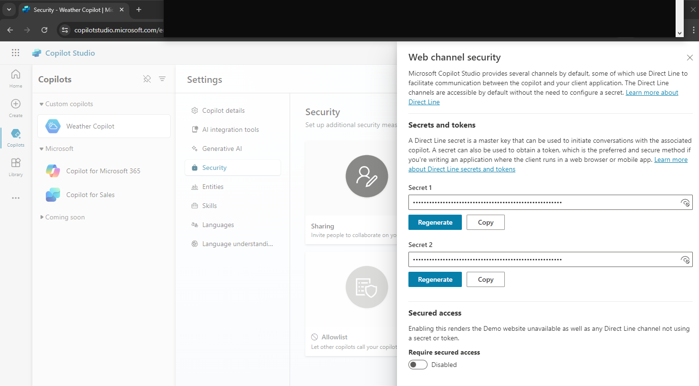

# Microsoft CoPilot Studio

https://copilotstudio.microsoft.com/

## Find the App ID

The App Id is found in CopilotStudio>WeatherCopilot>Channels>CustomerEngagementHub>LivePerson

Select the Channels tab, then click on one of the Customer Engagement Hubs, you will see the App ID.

## Find the Direct Line Secret

The Direct Line secret is found in 
CopilotStudio>Settings>Security>WebChannelSecurity

