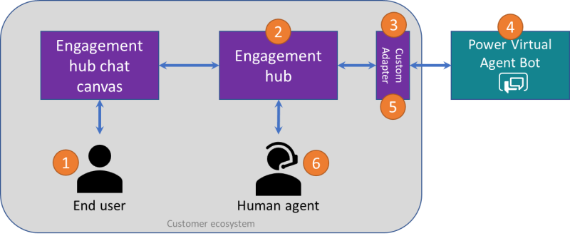

# Demo Azure Chat-Bot Handoff to Mitel MiCC-B Human Agent

This project is a Proof of Concept to demonstrate human handoff of Azure Chat Bot conversations to a human Agent on a Mitel MiCC-B Contact Center.

This bot has been created using [Bot Framework](https://dev.botframework.com), it shows how to create a simple bot that accepts input from the user and echoes it back. I followed [these steps](https://learn.microsoft.com/en-us/azure/bot-service/bot-service-quickstart-create-bot?view=azure-bot-service-4.0&tabs=javascript%2Cvs#start-your-bot) to create a simple Echo Bot then enhanced that to become this project.


## General Architecture

This software is based on this diagram from [Configure handoff to any generic engagement hub](https://learn.microsoft.com/en-us/microsoft-copilot-studio/configure-generic-handoff).


1. An end user interacts with a bot that contains this Interceptor middleware.

2. The Engagement hub is an MiCC-B with support for incoming chat conversations.

3. The Relay Bot relays the incoming chat messages from the user to a external Bot (such as one created with Microsoft Copilot Studio).

4. Once the end user triggers handoff, Copilot Studio (ie, the bot that detected user's handoff intent) returns a handoff event with full conversational context (transcript). 

5. The Interceptor Middleware intercepts the handoff event, routes the chat to either a Bot or a Human Agent.

6. The end user's chat is seamlessly and contextually handed off to a human agent who can resume the conversation.


## What's Included

This package contains the following major components. You will select the components you want to use in the index.ts file.

There are 2 main configurations,
1. if you are creating your own Bot Framework SDK bot, then you only need to place the Interceptor middleware in the pipeline ahead of your Bot.
2. if you have a running bot that you cannot modify (sw), such as one created by Microsoft CoPilot Studio, then you would build an Interceptor/Relay Bot based on  this package. Configure your users to connect to this bot and the RelayBot to connect to your target bot.

### Interceptor Middleware

Note, the transcript is included in the `handoff.initiate` event. If your bot does not include a transcript, you could consider [TranscriptLoggerMiddleware](https://github.com/Microsoft/botbuilder-js/blob/main/libraries/botbuilder-core/src/transcriptLogger.ts) which is part of botbuilder-core package.

#### Configuration
Uses Mitel WorkFlow. You will need to provide the WorkFlow webhook URL.
##### Environment Variables
MITEL_ENDPOINT='https://workflow.us.dev.api.mitel.io/2017-09-01/webhooks/accounts/---hidden---'
##### Data Store

### Echo Bot

This is as generated by [these steps](https://learn.microsoft.com/en-us/azure/bot-service/bot-service-quickstart-create-bot?view=azure-bot-service-4.0&tabs=javascript%2Cvs#start-your-bot) and enhanced to return a `handoff.initiate` event when the user includes the word `human`.


### Relay Bot

A simple bot that forwards all messages to an external bot and relays responses back to your client. You would add the Interceptor Middleware to route the conversation to the MiCC-B when the `handoff.initiate` event is detected.


#### Configuration
Uses the Directline service provided by Microsoft. You will need to provide the remote bot's application-ID and Directline secret.
##### Environment Variables
REMOTE_BOT_APP_ID='---hidden---'  (Eg found in CopilotStudio>Your-Copilot-Name>Channels>CustomerEngagementHub>LivePerson )
REMOTE_BOT_DIRECT_LINE_SECRET='---hidden---'
##### Data Store


## Prerequisites

- [Node.js](https://nodejs.org) I used version 18.20.3

    ```bash
    # determine node version
    node --version
    ```

## To run the bot

- Install modules

    ```bash
    npm install
    ```
- Start the bot

    ```bash
    npm start
    ```

## Testing the bot using Bot Framework Emulator

[Bot Framework Emulator](https://github.com/microsoft/botframework-emulator) is a desktop application that allows bot developers to test and debug their bots on localhost or running remotely through a tunnel.

- Install the Bot Framework Emulator version 4.9.0 or greater from [here](https://github.com/Microsoft/BotFramework-Emulator/releases)

### Connect to the bot using Bot Framework Emulator

- Launch Bot Framework Emulator
- File -> Open Bot
- Enter a Bot URL of `http://localhost:3978/api/messages`

## Deploy the bot to Azure

### Publishing Changes to Azure Bot Service

    ```bash
    # build the TypeScript bot before you publish
    npm run build
    ```

    ```bash
    PS C:\_gitrepos\cloudlink-chatoverlay\poc-azure-bot-handoff>  az webapp deployment source config-zip --resource-group "cloudlink-poc-don" --name "mitel-appServiceName-cloudlink-poc-don-1" --src "poc-azure-bot-handoff.zip"
    ```

To learn more about deploying a bot to Azure, see [Deploy your bot to Azure](https://aka.ms/azuredeployment) for a complete list of deployment instructions.

## Further reading

- [Bot Framework Documentation](https://docs.botframework.com)
- [Bot Basics](https://docs.microsoft.com/azure/bot-service/bot-builder-basics?view=azure-bot-service-4.0)
- [Dialogs](https://docs.microsoft.com/en-us/azure/bot-service/bot-builder-concept-dialog?view=azure-bot-service-4.0)
- [Gathering Input Using Prompts](https://docs.microsoft.com/en-us/azure/bot-service/bot-builder-prompts?view=azure-bot-service-4.0)
- [Activity processing](https://docs.microsoft.com/en-us/azure/bot-service/bot-builder-concept-activity-processing?view=azure-bot-service-4.0)
- [Azure Bot Service Introduction](https://docs.microsoft.com/azure/bot-service/bot-service-overview-introduction?view=azure-bot-service-4.0)
- [Azure Bot Service Documentation](https://docs.microsoft.com/azure/bot-service/?view=azure-bot-service-4.0)
- [Azure CLI](https://docs.microsoft.com/cli/azure/?view=azure-cli-latest)
- [Azure Portal](https://portal.azure.com)
- [Language Understanding using LUIS](https://docs.microsoft.com/en-us/azure/cognitive-services/luis/)
- [Channels and Bot Connector Service](https://docs.microsoft.com/en-us/azure/bot-service/bot-concepts?view=azure-bot-service-4.0)
- [TypeScript](https://www.typescriptlang.org)
- [Restify](https://www.npmjs.com/package/restify)
- [dotenv](https://www.npmjs.com/package/dotenv)
