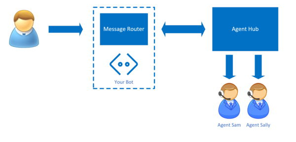
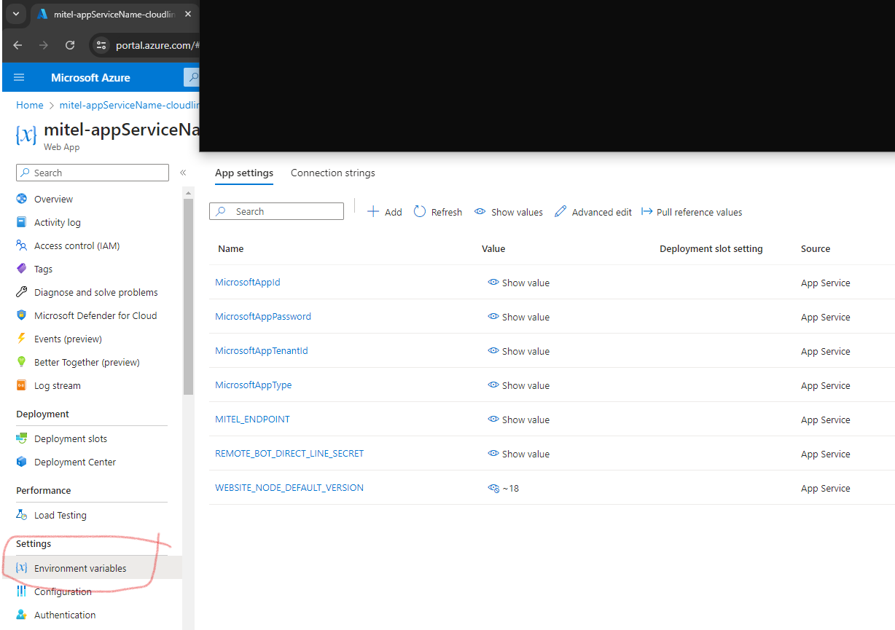

# Demo Azure Chat-Bot Handoff to Mitel MiCC-B Human Agent

This project, [CL-13602](https://mitel.atlassian.net/browse/CL-13602), is a Proof of Concept to demonstrate human handoff of Azure Chat Bot conversations to a human Agent on a Mitel MiCC-B Contact Center.

Uses [Bot Framework](https://dev.botframework.com) v4

For our purposes, a `bot` is software that is programed to generate a response to text messages.

There are 2 bots in here,
1. **EchoBot** will simply return to you anything you say, it was created by following the instruction provided [here](https://learn.microsoft.com/en-us/azure/bot-service/bot-service-quickstart-create-bot?view=azure-bot-service-4.0&tabs=javascript%2Cvs#create-a-bot). To use this bot, modify the [index.ts](./src/index.ts) like so
    ```js
    const myBot = new EchoBot();
    ```
2. **RelayBot** will forward anything you say to a remote bot via the Directline v3 protocol. To use this bot, modify the [index.ts](./src/index.ts) like so
    ```js
    const myBot = new RelayBotAxios();
    ```


## General Architecture

There is [Interceptor middleware](./src/middleware/interceptor.middleware.ts) that is placed in the event pipeline ahead of the target bot. When the interceptor sees a `handoff` event from the bot, it will route all future messages to a Mitel Contact Center Agent.

If you have access to the source code of your bot, then you can add the Interceptor middleware to handle your bot's human handoff requests.

If you do not have access to your bot's source code, then you can use the RelayBot as a man-in-the-middle bot that will sit between your chat widget (or channel) and your deployed custom bot (such as created by Microsoft CoPilot Studio).

Together, the Interceptor and a Mitel MiCC implement The Engagement Hub that is found in this diagram from [Configure handoff to any generic engagement hub](https://learn.microsoft.com/en-us/microsoft-copilot-studio/configure-generic-handoff).


1. An end user interacts with a bot that contains this Interceptor middleware.

2. The Engagement hub is this Interceptor paired with an MiCC-B that supports incoming chat conversations.

3. The Relay Bot relays the incoming chat messages from the user to a external Bot, such as one created with Microsoft Copilot Studio (formerly Power Virtual Agent).

4. Once the end user triggers handoff, the target bot (ie, the bot that detected user's handoff intent) returns a handoff event with transcript. 

5. The Interceptor Middleware routes messages to the bot or a MiCC-B Human Agent depending on detection of the handoff event.

6. The end user's chat is seamlessly and contextually handed off to a human agent who can resume the conversation.


## What's Included

This package contains the following major components. You will select the components you want to use in the index.ts file.

There are 2 main configurations,
1. if you are creating your own Bot Framework SDK bot, then you only need to place the Interceptor middleware in the pipeline ahead of your Bot. Your bot will need to send a `handoff.initiate` activity when it wants to handoff to a human.
2. if you have a running bot that you cannot modify (sw), such as one created by Microsoft CoPilot Studio, then you would build an Interceptor/Relay Bot based on this package. Configure your users to connect to this bot and the RelayBot to connect to your target bot.

### Interceptor Middleware

The Inteceptor implements `Bot as a proxy` as described in Azure's [Bot Design Pattern for Human Handoff](https://learn.microsoft.com/en-us/azure/bot-service/bot-service-design-pattern-handoff-human?view=azure-bot-service-4.0#bot-as-a-proxy) 

The Interceptor will watch for `handoff.initiate` and route messages based on conversation state.
```js
export enum InterceptorState {
    bot,        // messages flow to the bot
    queued,     // awaiting a human agent
    agent       // messages flow to human agent 
}
```

Note, the transcript is included in the `handoff.initiate` event. If your bot does not include a transcript, you could consider [TranscriptLoggerMiddleware](https://github.com/Microsoft/botbuilder-js/blob/main/libraries/botbuilder-core/src/transcriptLogger.ts) which is part of botbuilder-core package.

#### Configuration
Uses Mitel WorkFlow. You will need to provide the WorkFlow webhook URL.
##### Environment Variables
MITEL_ENDPOINT='https://workflow.us.dev.api.mitel.io/2017-09-01/webhooks/accounts/---hidden---'
##### Data Store
If you will be running multiple instances of this code then you will need to hook up external data storage. This is currently implemented as a JS Map.

### Echo Bot

This sample was generated via [these steps](https://learn.microsoft.com/en-us/azure/bot-service/bot-service-quickstart-create-bot?view=azure-bot-service-4.0&tabs=javascript%2Cvs#create-a-bot) and enhanced to return a `handoff.initiate` event when the user's message includes the word `human`.


### Relay Bot

A simple bot that forwards all messages to an external bot and relays responses back to your client. You would add the Interceptor Middleware to route the conversation to the MiCC-B when the `handoff.initiate` event is detected.


#### Configuration
Uses the Directline service provided by Microsoft. You will need to provide the remote bot's application-ID and Directline secret. If your remote bot is from CoPilot Studio, you can find these keys[here](./README-copilot-studio.md)
##### Environment Variables
REMOTE_BOT_APP_ID='---hidden---'  (Eg found in CopilotStudio>Your-Copilot-Name>Channels>CustomerEngagementHub>LivePerson )
REMOTE_BOT_DIRECT_LINE_SECRET='---hidden---'
##### Data Store
If you will be running multiple instances of this code then you will need to hook up external data storage. This is currently implemented as a JS Map.


## Environment File

To run this locally you will need an environment file called `.env` that will contain your secret keys. Include this file in your `.gitignore` so that these keys are not shared.

```bash
MicrosoftAppType='MultiTenant'
MicrosoftAppId='your app ID'
MicrosoftAppPassword='your app password'
MicrosoftAppTenantId=
REMOTE_BOT_APP_ID='if using RelayBot, the app ID of the bot that you will forward to'
# ^^ found in CopilotStudio>WeatherCopilot>Channels>CustomerEngagementHub>LivePerson
REMOTE_BOT_DIRECT_LINE_SECRET='if using RelayBot, the Direct Line Secret of the bot that you will forward to'
MITEL_ENDPOINT='https://workflow.us.dev.api.mitel.io/2017-09-01/webhooks/accounts/*****hidden*****/workers'
```

You will add these environment variables to your Azure Portal's Web App configuration

## Prerequisites

- [Node.js](https://nodejs.org) I used version 18.20.3

    ```bash
    # determine node version
    node --version
    ```

## To run the bot

- Install modules

    ```bash
    npm install
    ```
- Create the .env file
- Start the bot

    ```bash
    npm start
    ```

## Testing the bot using Bot Framework Emulator

[Bot Framework Emulator](https://github.com/microsoft/botframework-emulator) is a desktop application that allows bot developers to test and debug their bots on localhost or running remotely through a tunnel.

- Install the Bot Framework Emulator version 4.9.0 or greater from [here](https://github.com/Microsoft/BotFramework-Emulator/releases)

### Connect to the bot using Bot Framework Emulator

- Launch Bot Framework Emulator
- File -> Open Bot
- Enter a Bot URL of `http://localhost:3978/api/messages`

## Deploy the bot to Azure

### Publishing Changes to Azure Bot Service

```bash
# build the TypeScript bot before you publish
npm run build
```

```bash
# zip up the contents of this folder (at a minimum, these: dist, node_modules, web.config)
# push to Azure with the Azure CLI tool
az webapp deployment source config-zip --resource-group "your-resource-group" --name "your-app-service-name" --src "bot.zip"
```

To learn more about deploying a bot to Azure, see [Deploy your bot to Azure](https://aka.ms/azuredeployment) for a complete list of deployment instructions.

## Further reading

- [Bot Framework Documentation](https://docs.botframework.com)
- [Bot Basics](https://docs.microsoft.com/azure/bot-service/bot-builder-basics?view=azure-bot-service-4.0)
- [Dialogs](https://docs.microsoft.com/en-us/azure/bot-service/bot-builder-concept-dialog?view=azure-bot-service-4.0)
- [Gathering Input Using Prompts](https://docs.microsoft.com/en-us/azure/bot-service/bot-builder-prompts?view=azure-bot-service-4.0)
- [Activity processing](https://docs.microsoft.com/en-us/azure/bot-service/bot-builder-concept-activity-processing?view=azure-bot-service-4.0)
- [Azure Bot Service Introduction](https://docs.microsoft.com/azure/bot-service/bot-service-overview-introduction?view=azure-bot-service-4.0)
- [Azure Bot Service Documentation](https://docs.microsoft.com/azure/bot-service/?view=azure-bot-service-4.0)
- [Azure CLI](https://docs.microsoft.com/cli/azure/?view=azure-cli-latest)
- [Azure Portal](https://portal.azure.com)
- [Language Understanding using LUIS](https://docs.microsoft.com/en-us/azure/cognitive-services/luis/)
- [Channels and Bot Connector Service](https://docs.microsoft.com/en-us/azure/bot-service/bot-concepts?view=azure-bot-service-4.0)
- [TypeScript](https://www.typescriptlang.org)
- [Restify](https://www.npmjs.com/package/restify)
- [dotenv](https://www.npmjs.com/package/dotenv)
